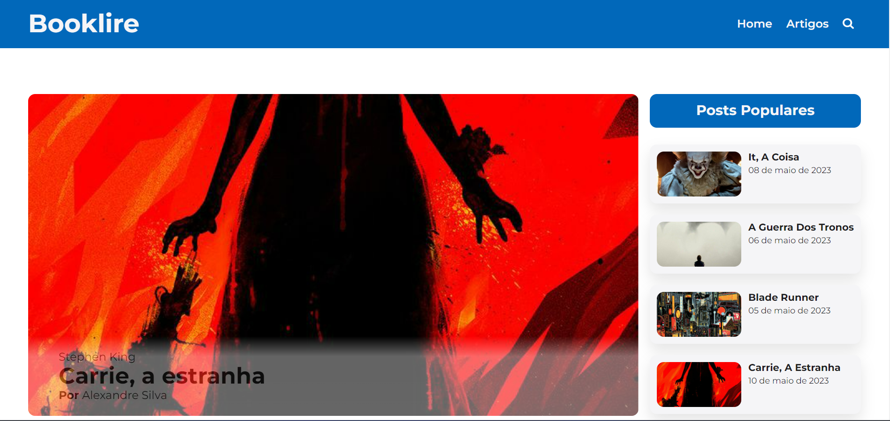
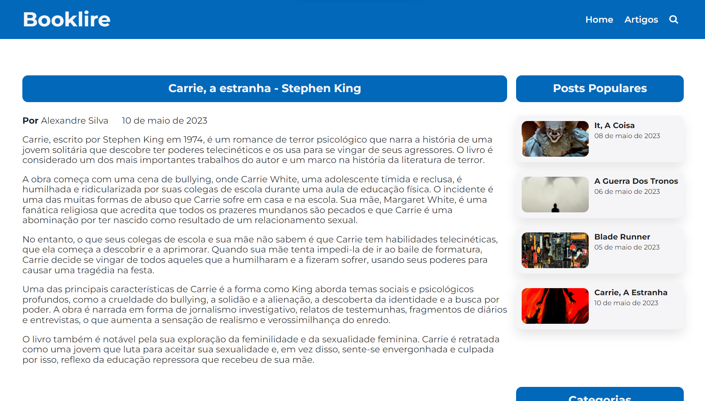
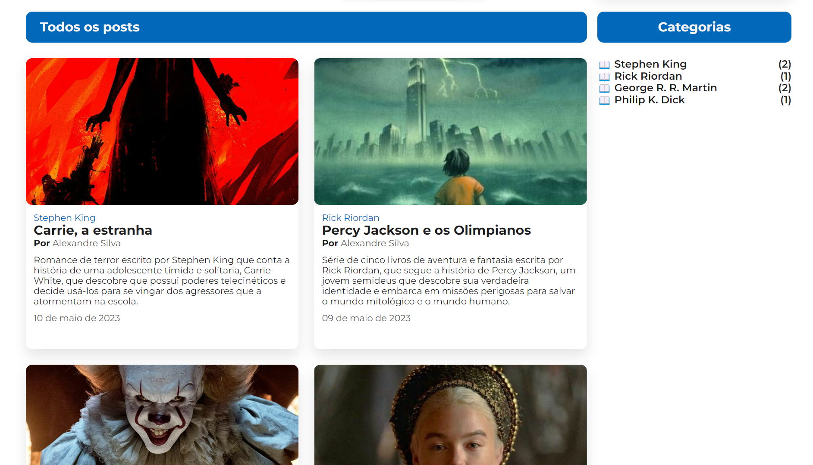

# Blog Responsivo - Booklire

---

## Visite o blog no Github Pages <a href="https://thekidisalright.github.io/responsividade/" target="_blank">aqui</a>

---

Durantes as aulas de Programação Web 1, vimos o que é responsividade e como criar um website responsivo. Este repositório é uma atividade onde temos que desenvolver
um blog responsivo.

O meu website responsivo é um blog de resumo de obras literárias, chamado Booklire.

## Telas do blog

<figure>
    
    
    
</figure>